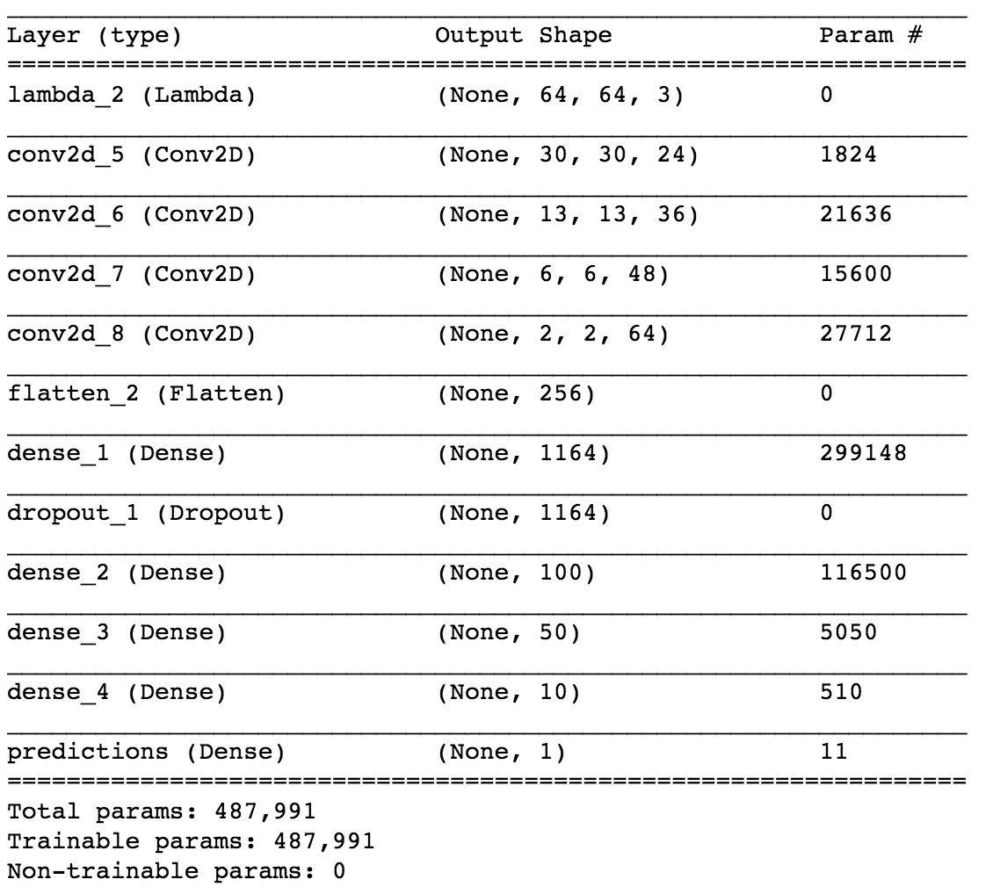

# **Behavioral Cloning** 
---

**Udacity Self Driving Car Behavioral Cloning Project**

The goals / steps of this project are the following:
* Use the simulator to collect data of good driving behavior
* Build, a convolution neural network in Keras that predicts steering angles from images
* Train and validate the model with a training and validation set
* Test that the model successfully drives around track one without leaving the road
* Summarize the results with a written report

## Rubric Points
### Here I will consider the [rubric points](https://review.udacity.com/#!/rubrics/432/view) individually and describe how I addressed each point in my implementation.  

---
### Files Submitted & Code Quality

#### 1. Submission includes all required files and can be used to run the simulator in autonomous mode

My project includes the following files:
* model.ipynb containing the python notebook to create and train the model
* drive.py for driving the car in autonomous mode
* model.h5 containing a trained convolution neural network 
* README.md summarizing the results
* video.mp4 containing the video of a run in autonomous mode through the track.

#### 2. Submission includes functional code
Using the Udacity provided simulator and my drive.py file, the car can be driven autonomously around the track by executing 
```sh
python drive.py model.h5
```

#### 3. Submission code is usable and readable

The model.ipynb file contains the code for training and saving the convolution neural network. The file shows the pipeline I used for training and validating the model, and it contains comments to explain how the code works.

### Model Architecture and Training Strategy

#### 1. An appropriate model architecture has been employed

The model architecture I chose to use was the same one that [NVIDIA's article](https://devblogs.nvidia.com/parallelforall/deep-learning-self-driving-cars/) employs. The basic idea is to use convolutional layers at the beginning to extract image features and then use a series of Fully Connected layers at the end to regress on the steering wheel. 

. 

This model architecture was not my first choice. I had tried other architectures like using InceptionV3 and also a simple model with fewer conv and fully connected layers. However, the model adapted from the architecture in NVIDIA's blog was the one that was ultimately most effective in reaching a working solution. 

#### 2. Attempts to reduce overfitting in the model

The model contains a single dropout layer with a dropout rate of 50% in order to reduce overfitting (See image above). Additionally more data was collected by driving around the track in both directions to provide additional information about cases where the steering angle correction needs to be drastic. This additional data collection allows us to add more of these edge cases during training to balance the dataset.

The model was trained and validated with data coming from multiple data sets to ensure that the model was not overfitting. The model was tested by running it through the simulator and ensuring that the vehicle could stay on the track.

#### 3. Model parameter tuning

The model used an adam optimizer with default parameters, so the learning rate was not tuned manually.

#### 4. Appropriate training data

Training data was chosen to keep the vehicle driving on the road. I used a combination of center lane driving, recovering from the left and right sides of the road.

For details about how I created the training data, see the next section. 

### Model Architecture and Training Strategy

#### 1. Solution Design Approach

The overall strategy for deriving a model architecture was to ...

My first step was to use a simple 3 layer convolution neural network with some batch normalization and dropouts to avoid overfitting. I thought this model might be sufficient because the image scenes weren't too complex and wouldn't need too many deep layers and thereby run faster. However, this model was unable to correct well when it encountered edge cases like the lake.

Next step I considered was to use a transfer learning approach using InceptionV3. Strangely, the InceptionV3 model based transfer learning approach was not able to produce good results. I expected transfer learning approach to work for this problem since we had fewer images to train with, but it may just be that since InceptionV3 was trained on imagenet which was mostly comprised on natural images while the gaming engine produces synthetic images, the results were not quite as good as I had hoped. Another reason could be that I did not train the base layers in the InceptionV3 model and instead chose to fine tune the newly added layers. Perhaps adding the ability to train the base layers could be something that while slowing down the training process, may ultimately be necessary in order for this approach to work.

Finally I deciced to try the architecture adopted by NVIDIA witha a few modifications to speed up training. I chose to use 64x64x3 images without any cropping. I also removed the last 3x3 convolution layer at the end since the input images were 64x64 and the feature maps at this
depth in the network were 2x2x64 and would be sufficient. Finally the model architecture summary looks as follows. 

In order to gauge how well the model was working, I chose to run the model against the simulator. The validation dataset losses and accuracies didn't provide me much insight which could be because this was a regression problem and it wouldn't be necessary for the network to provide the exact same answer as the validation dataset in order to be effective ultimately.

To combat the overfitting, I modified the model so that I added a dropout layer after the first fully connected layer.

The final step was to run the simulator to see how well the car was driving around track one. There were a few spots where the vehicle fell off the track, particularly near the lake area and in sharp turn after crossing the bridge section of the track. To improve the driving behavior in these cases, I collected additional data that focused on sharp turns and I also drove on the more challenging track to augment the dataset with entirely new set of images.

At the end of the process, the vehicle is able to drive autonomously around the track without leaving the road in a relatively smooth fashion.

#### 2. Creation of the Training Set & Training Process

To capture good driving behavior, I first recorded two laps on track one using center lane driving. Here is an example image of center lane driving:


I then recorded the vehicle recovering from the left side and right sides of the road back to center so that the vehicle would learn to steer and recover back to the center from these situations. These images show what a recovery looks like.

Start of recovery


Mid recovery


Back to the center


Then I repeated this process on track two in order to get more data points.

To augment the data sat, I also flipped images and angles thinking that this would provide additional data for helping the network learn how to recover to the center of the lane no matter which side of the center of the lane the vehicle was currently on. In addition I added additional images with brightened and darkened scenes to increase robustness to shadows and darker or brighter segments of the track.

For example, here is an image that has then been flipped:


Here's an image that is darker than the original image


To train the network on this data, I combined the data from the provided dataset along with the other two collected datasets with additional example of sharp turns and recovery situations into a single pandas dataframe. Still this dataset was biased towards containing a lot of data where the steering angle is between -0.5 and 0.5. To balance the dataset I dropped 70% of the data where the command is to stay the course straight and instead focus more on the sharper corrections. I also used np.random.choice to pick the center frame images with lower probability and pick the left and right camera data with greater probability.

I finally randomly shuffled the data set and put 20% of the data into a validation set. 

I used this training data for training the model. The validation set helped determine if the model was over or under fitting during the training process by helping me tune the amount of the dropout that was necessary. The ideal number of epochs was 50 and running more epochs didn't necessarily improve the results too much. I used an adam optimizer so that manually training the learning rate wasn't necessary. 
